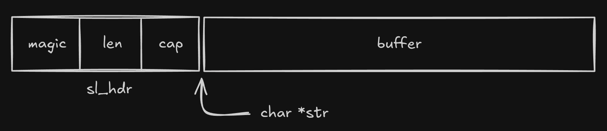

# sl_hdr

## Definition
```c
typedef struct {
    uint32_t magic;
    size_t   len;   
    size_t   cap;
} sl_hdr;
```

## Description
`sl_hdr` is the **internal header structure** stored immediately before the string payload returned by `sl_create`.

It contains metadata required to manage the string:
- `magic`: set to [`SL_MAGIC`](../constants/SL_MAGIC.md), used to validate that the pointer is a legitimate sl_string.
- `len`: the current length of the string, excluding the null terminator.
- `cap`: the total capacity of the payload buffer, in bytes (including space for `'\0'`).

The header is not exposed in the public API and should never be accessed or modified directly. It's accessed internally using `sl_get_hdr`.

## Memory Layout


The pointer returned by `sl_create` (`char *str`) always points to the payload, not to the header.

This ensures strings remains compatible with all standard C-string functions.

The user never needs to interact with the header — it is managed entirely by the library.